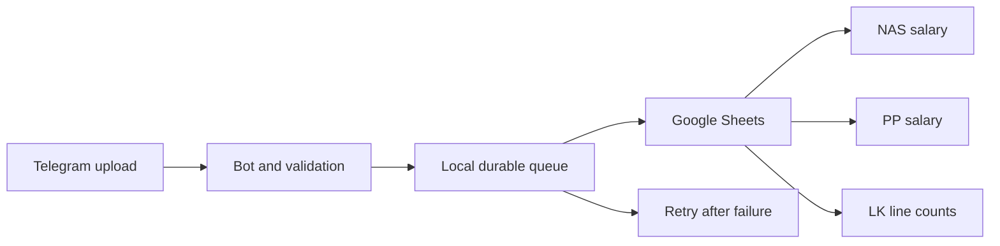

# Subtitle Salary Calculator

A Telegram bot that counts Burmese subtitle cues, calculates pay under destination-specific rules, and records the results in Google Sheets. It supports NAS and PP salary sheets plus LK, a count-only destination.

## What it does

- **NAS:** accepts `20ks` and `25ks` tags and can add a 1,500 Ks review fee for qualifying part-one movies or first episodes in any season.
- **PP:** accepts `(v)`, `(p)`, `(mm)`, and `(old)` tags. PP never has a review fee.
- **LK:** requires no rate tag and records only each filename and subtitle line count. It sorts names alphabetically and highlights names containing `fix`, `fixed`, `check`, or `checked`.
- Counts subtitle cues rather than physical file lines. An SRT cue with a timestamp and no dialogue still counts; separator lines do not.
- Reads SRT, ASS, and TXT files. SRT cue IDs may be omitted or use numeric forms such as `34-1`; cue separators and common timestamp precision variants are handled.
- Keeps work that could not be written to Google Sheets in a local retry queue. `/pending` and `/retry` help recover it after a Sheets or network failure.
- Prevents duplicate filenames within the selected destination and month. `/undo` previews a record and requires confirmation before removing it.

## How it works

1. A chat selects a destination with `/sheet` and a monthly tab with `/month`.
2. The bot downloads the subtitle, decodes the text, validates its format, checks for Myanmar dialogue, counts cues, and reads the filename's rate tag.
3. It calculates the amount according to the chosen destination, then stores the item locally before writing it to Google Sheets.
4. The Sheets layer reads the month's existing records, validates their layout, rebuilds the destination's tables and totals, and applies the changes in one atomic API request. It saves a local value snapshot before each write.
5. If Google Sheets is unavailable, the saved item stays queued for retry. Undo uses local ownership metadata to ensure the original submitter in the same chat confirms removal.



## Project structure

| Path | Responsibility |
| --- | --- |
| `ultimate-bot/bot.py` | Telegram commands, chat settings, file processing, and queue recovery |
| `ultimate-bot/logic.py` | Text decoding, subtitle parsing, line counting, language checks, rate tags, and review fees |
| `ultimate-bot/sheets.py` | Monthly tabs, destination tables, validation, atomic sheet updates, local backups, and undo support |
| `ultimate-bot/storage.py`, `pending_store.py` | Atomic local JSON persistence for settings, queues, and metadata |
| `ultimate-bot/bridge.py` | Authenticated HTTP bridge for Telegram updates forwarded by n8n |
| `ultimate-bot/n8n/` | Importable n8n workflow example |
| `tests/`, `ultimate-bot/test_logic.py` | Offline unit and integration-style tests using fake Telegram and Google clients |
| `spec.md` | Detailed behavior contract |
| `ROADMAP.md` | Portfolio-oriented project plan and next steps |

## Requirements and setup

Python **3.10 or newer**, a Telegram bot token, Google Sheets and Drive APIs, and a Google service account. Run one bot process per token and local data directory.

From the project root:

```powershell
python -m venv .venv
.venv\Scripts\Activate.ps1
python -m pip install -r ultimate-bot/requirements.txt
Copy-Item ultimate-bot/.env.example ultimate-bot/.env
```

On Linux/macOS, activate with `source .venv/bin/activate` and copy the example with `cp ultimate-bot/.env.example ultimate-bot/.env`.

1. Create a bot with Telegram's `@BotFather` and set `TELEGRAM_BOT_TOKEN` in `ultimate-bot/.env`.
2. Enable the Google Sheets and Google Drive APIs in a Google Cloud project. Create a service account and save its key as `ultimate-bot/sheets-service-account.json`.
3. Create three Google spreadsheets named **Salary NAS**, **Salary PP**, and **Salary LK**. Share them with the service-account email as **Editor**.
4. Add their spreadsheet IDs to `NAS_SHEET_ID`, `PP_SHEET_ID`, and `LK_SHEET_ID`. The ID is the part between `/d/` and `/edit` in each spreadsheet URL.
5. Start the bot from the project root:

```powershell
python ultimate-bot/bot.py
```

Configuration paths are resolved relative to `ultimate-bot`; environment variables override values from `.env`. Pre-created spreadsheets are recommended. A service account may not be able to create files even when it can access a shared folder.

## Bot commands

| Command | Purpose |
| --- | --- |
| `/start`, `/help` | Show instructions and current chat settings |
| `/sheet` | Choose NAS, PP, or LK for this chat |
| `/month` | Choose a monthly tab such as `8.2026` |
| `/status` | Show the current destination and month |
| `/payslit` | Show totals and file counts for the selected destination/month |
| `/link` | Show the configured spreadsheet links |
| `/reset` | Clear the chat's destination and month choices |
| `/resetmonth` | Legacy alias for `/reset` |
| `/resetyear` | Choose another year while keeping the selected month and destination |
| `/pending` | List queued files waiting for processing |
| `/retry` | Retry saved files once |
| `/undo`, `/undo confirm` | Preview and confirm removal of your latest eligible record |

`/payslit` includes salary, review totals, review-file count, total lines, and file count for NAS. PP displays salary without review fees. LK displays line and file counts only.

## Try the offline demo

Reviewers can run `python -X utf8 demo/run_demo.py` to see the calculated NAS, PP, and LK worksheet rows. It uses fictional subtitle samples and the same parser, pay rules, and row builder as the bot, but makes no Telegram or Google requests and needs no credentials. See [demo/README.md](demo/README.md) for an example result.

## Rules and data handling

The rate and review rules are in [spec.md](spec.md). Chat settings are shared by the people in a chat. Any Telegram account can use the bot; there is no user allowlist. Undo checks the original user and chat using local metadata kept in the ignored `record_metadata.json` file.

Queued items include subtitle text and submitter data. Local metadata and backups contain operational or salary information. Keep the bot's data directory private and back it up securely. Google monthly tabs are intended for bot-managed records; avoid editing them at the same time as bot writes.

## Operating modes

- `BOT_MODE=poll` (default): long polling; no public endpoint or n8n needed.
- `BOT_MODE=webhook`: direct Telegram webhook. Set a public HTTPS `WEBHOOK_URL` and a random `WEBHOOK_SECRET` of 16–256 letters, digits, underscores, or hyphens. Forward traffic to `WEBHOOK_PORT` (default `8080`).
- `BOT_MODE=bridge`: authenticated endpoint for updates forwarded by n8n. Import `ultimate-bot/n8n/salary-calculator-bridge.json`, set the bot credential and matching secret values, and use `http://<bot-host>:8080/<secret>` with the `X-Telegram-Bot-Api-Secret-Token` header. Bridge mode does not replace Telegram's webhook.

Only one Telegram listener can own a bot token at a time. A reverse proxy and hosted deployment are outside this repository.

## Development

```powershell
python -m pip install -r requirements-dev.txt
python -m pytest
python -m ruff check .
python scripts/check_secrets.py
```

Tests use fake Telegram and Google services, block external HTTP calls, and do not need credentials. GitHub Actions runs checks on Windows and Linux with Python 3.10 and 3.12.

## Portfolio and privacy

You do **not** need to make your Salary Google Drive folder or live spreadsheets public. Keep real salary data private. If you want to demonstrate the spreadsheet layout, prepare a separate copy with synthetic filenames and amounts and share only that demo copy. Do not include live sheet IDs, bot tokens, service-account files, subtitle contents, or personal salary records in screenshots or repository files.

The repository can be public for portfolio review while its connected Google sheets remain private. This repository currently has no license file, so public visibility permits people to view the source but does not grant permission to reuse or redistribute it.

See [ROADMAP.md](ROADMAP.md) for planned improvements and [SECURITY.md](SECURITY.md) for credential handling. Run `python scripts/check_secrets.py` and review the staged diff before every push; the scanner catches common secret formats but cannot detect every possible leak.
